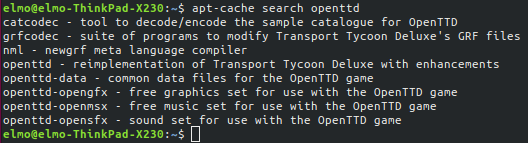
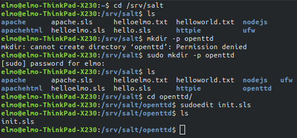
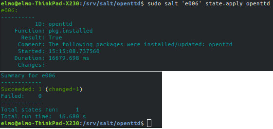
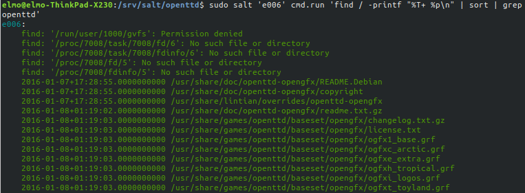
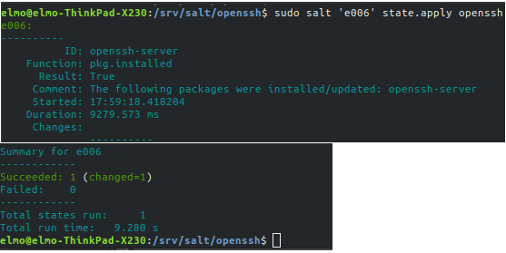

# Harjoitus 4

Tähän harjoitukseen valitsin kohdan "B" suorittamisen, eli asentaisin 6 saltin tilaa/modulia.

Harjoitusta varten loin uuden orja-koneen 'e006', mutta tavallisesta poiketen säädin asetukset luomani skriptin avulla. En mene tässä tarkemmin skriptin toimintaan, mutta voit tarkastella sitä [täältä.](https://github.com/rootElmo/Agent-Setter)

Kokeilin aluksi yhteyttä orja-koneeseen ajamalla perinteisen 'whoami':n

	master $ sudo salt 'e006' cmd.run 'whoami'

Saltille saapui vastaus:

	e006:
		root

Seuraavaksi tarvitsi valita jokin ohjelma asennettavaksi. Olen asentanut omalle koneelleni joskus muinoin OpenTTD-pelin, joka on avoimen Transport Tycoon-peliin perustuva avoimen lähdekoodin uudelleenkirjoitus. Muistan kuitenkin, että asensin sen silloin käsin ja että se ei ollut hirveän intuitiivinen prosessi.

Kokeilin ajaa seuraavan komennon katsoakseni, voisiko OpenTTD:n asnetaa apt-getin kautta:

	master $ apt-cache search openttd

Kuinka ollakkaan, kyseinen paketti löytyi!

Voin siis luoda pelin asennusta ja säätämistä varten salt-modulin ilman 'cmd.run' tmv. kikkailuja.

Loin uuden kansion "**openttd**" kansioon **/srv/salt**, ja loin init.sls tiedoston kansioon tilaa varten.

Muokkasin init.sls:n seuraavaan tilaan:

	openttd:
	  pkg.installed

Ajoin tilan aktiiviseksi orja-koneelle:

	master $ sudo salt 'e006' state.apply openttd

Salt kertoo muutoksen onnistuneen

En ollut aivan varma siitä, mihin OpenTTD luo tiedostonsa asennuksen yhteydessä, joten ajoin seuraavan komennon:

	sudo salt 'e006' cmd.run 'find / -printf "%T+ %p\n" | sort | grep openttd'

#### *Selvitin pienen tauon jälkeen seuraavassa osiossa kuvaillun ongelman SSH:n käytön suhteen. Pidän sen kuitenkin sellaisenaan raportissa*

*Pitkähköstä tulosteesta selvisi, että iso määrä tiedostoja oli luotu kohteeseen* ***/usr/share/games/openttd***. *Tässä vaiheessa avaisin SSH-yhteyden orja-koneeseen, mutta aikaisemmista yrityksistäni huolimatta en ole saanut SSH:lla yhteyttä oman koneeni ulkopuolisiin koneisiin, jotka ovat samassa verkossa. Oletan vian olevan asuntoni reitittimessä.*

*Emuloin SSH:ta käymällä katselemassa pöytäkoneeltani käsin orja-koneen kansioita.*

Sain loppujen lopuksi SSH-yhteyden orja-koneeseen. Asensin openssh-clientin orjakoneelle käsin ja kokeilin herra-koneelta kirjautumista, joka toimi. Olin olettanut, että kun komennolla

	slave $ which ssh

tulostaa terminaali ylensä jotain ja näin ollen SSH-yhteyden saamisen pitäisi onnistua. Poistin openssh-serverin orja-koneelta

	slave $ sudo apt-get purge openssh-server

ja päätin tehdä openssh-serverin asennuksesta oman tilan herrakoneella.

Prosessi meni aluksi hyvin pitkälti samalla tavalla, kuin OpenTTD:tä asennettaessa. Tällä kertaa _init.sls_ sijaitsi vain kansiossa **/srv/salt/openssh**.

init.sls:

	openssh-server:
	  pkg.installed

Seuraavaksi ajoin tilan aktiiviseksi:

	master $ sudo salt 'e006' state.apply openssh

Tila aktivoitui onnistuneesti!

## Lähteet

Tero Karvinen: terokarvinen.com/2020/configuration-managment-systems-palvelinten-hallinta-ict4tn022-spring-2020/

ask ubuntu (SSH ongelmaa etsiessä): https://askubuntu.com/questions/218344/why-am-i-getting-a-port-22-connection-refused-error
