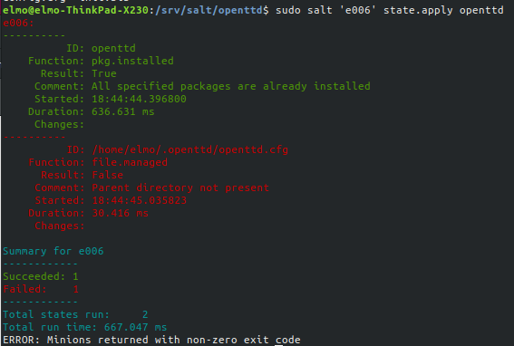

# Harjoitus 4

Tähän harjoitukseen valitsin kohdan "B" suorittamisen, eli asentaisin 6 saltin tilaa/modulia.

Harjoitusta varten loin uuden orja-koneen 'e006', mutta tavallisesta poiketen säädin asetukset luomani skriptin avulla. En mene tässä tarkemmin skriptin toimintaan, mutta voit tarkastella sitä [täältä.](https://github.com/rootElmo/Agent-Setter)

Kokeilin aluksi yhteyttä orja-koneeseen ajamalla perinteisen 'whoami':n

	master $ sudo salt 'e006' cmd.run 'whoami'

Saltille saapui vastaus:

	e006:
		root

## OpenTTD-modulin luominen

Seuraavaksi tarvitsi valita jokin ohjelma asennettavaksi. Olen asentanut omalle koneelleni joskus muinoin OpenTTD-pelin, joka on avoimen Transport Tycoon-peliin perustuva avoimen lähdekoodin uudelleenkirjoitus. Muistan kuitenkin, että asensin sen silloin käsin ja että se ei ollut hirveän intuitiivinen prosessi.

Kokeilin ajaa seuraavan komennon katsoakseni, voisiko OpenTTD:n asnetaa apt-getin kautta:

	master $ apt-cache search openttd

Kuinka ollakkaan, kyseinen paketti löytyi!

Voin siis luoda pelin asennusta ja säätämistä varten salt-modulin ilman 'cmd.run' tmv. kikkailuja.

Loin uuden kansion "**openttd**" kansioon **/srv/salt**, ja loin init.sls tiedoston kansioon tilaa varten.

Muokkasin init.sls:n seuraavaan tilaan:

	openttd:
	  pkg.installed

Ajoin tilan aktiiviseksi orja-koneelle:

	master $ sudo salt 'e006' state.apply openttd

Salt kertoo muutoksen onnistuneen

En ollut aivan varma siitä, mihin OpenTTD luo tiedostonsa asennuksen yhteydessä, joten ajoin seuraavan komennon:

	sudo salt 'e006' cmd.run 'find / -printf "%T+ %p\n" | sort | grep openttd'

#### *Selvitin pienen tauon jälkeen seuraavassa osiossa kuvaillun ongelman SSH:n käytön suhteen. Pidän sen kuitenkin sellaisenaan raportissa*

*Pitkähköstä tulosteesta selvisi, että iso määrä tiedostoja oli luotu kohteeseen* ***/usr/share/games/openttd***. *Tässä vaiheessa avaisin SSH-yhteyden orja-koneeseen, mutta aikaisemmista yrityksistäni huolimatta en ole saanut SSH:lla yhteyttä oman koneeni ulkopuolisiin koneisiin, jotka ovat samassa verkossa. Oletan vian olevan asuntoni reitittimessä.*

*Emuloin SSH:ta käymällä katselemassa pöytäkoneeltani käsin orja-koneen kansioita.*

## openssh-serverin asennus

Sain loppujen lopuksi SSH-yhteyden orja-koneeseen. Asensin openssh-serverin orjakoneelle käsin ja kokeilin herra-koneelta kirjautumista, joka toimi. Olin olettanut, että kun komennolla

	slave $ which ssh

tulostaa terminaali ylensä jotain ja näin ollen SSH-yhteyden saamisen pitäisi onnistua. Poistin openssh-serverin orja-koneelta

	slave $ sudo apt-get purge openssh-server

ja päätin tehdä openssh-serverin asennuksesta oman tilan herrakoneella.

Prosessi meni aluksi hyvin pitkälti samalla tavalla, kuin OpenTTD:tä asennettaessa. Tällä kertaa _init.sls_ sijaitsi vain kansiossa **/srv/salt/openssh**.

init.sls:

	openssh-server:
	  pkg.installed

Seuraavaksi ajoin tilan aktiiviseksi:

	master $ sudo salt 'e006' state.apply openssh

Tila aktivoitui onnistuneesti!

Seuraavaksi pyysin orja-koneen IP-osoitteen saltin kautta ja yritin SSH-yhteyttä.

	master $ sudo salt 'e006' cmd.run 'hostname -I'
	master $ ssh elmo@192.168.1.107

Pääsin orja-koneelle! Lähdin tutkimaan OpenTTD:n tiedostoja, jos niissä olisi jotain, jonka voisi lisätä OpenTTD:n tilaan. Pienen etsiskelyn jälkeen en kuitenkaan löytänyt mitään kummoisempia config-tiedostoja tai vastaavia, vaikka olin suhteellisen varma, että peli loisi sellaiset asentuessaan.

Löysin netistä keskustelun, jossa config-tiedoston poissaolo oltiin yhdistetty pelin asennukseen root-oikeuksilla. [Linkki keskusteluun](https://www.tt-forums.net/viewtopic.php?t=71557). Päätin kokeilla ehdotettua ratkaisua.

Lisäsin openttd-tilan _init.sls_-tiedostoon pari riviä

	openttd:
	  pkg.installed

	/home/elmo/.openttd/openttd.cfg:
	  file.managed:
	    - source: salt://openttd/config.cfg

Yritin ajaa tilan aktiiviseksi komennolla

	master $ sudo salt 'e006' state.apply openttd

mutta sain virheilmoituksen, sillä en ollut luonut kopioitavaa tiedostoa mihinkään. Loin nopeasti uuden tyhjän tiedoston, kuten linkkaamassani keskustelussa oltiin ehdotettu.

	master:/srv/salt/openttd $ sudo touch config.cfg

Yritin ajaa tilaa aktiiviseksi uudestaan. Sain virheilmoituksen, sillä orja-koneella ei ole olemassa kansiota ***"~/.openttd"***.

Ajattelin, että voisin luoda tuon kansion tilaan, ja puskea sen orja-koneelle config-tiedostoineen. Lueskelin [saltstacking dokumentaatiota](https://docs.saltstack.com/en/latest/ref/states/all/salt.states.file.html) ja löysinkin sieltä tarvitsemani.

Tein seuraavaksi muutoksia _init.sls_-tiedostoon:

	openttd:
	  pkg.installed
	
	/home/elmo/.openttd/:
	  file.directory:
	    - source: salt://openttd/config
	    - user: elmo
	    - group: elmo
	    - mode: 775
	    - recurse:
	      - user
	      - group
	      - mode

Ajoin tilan aktiiviseksi ja salt ilmoitti onnistumisesta!

Kävin SSH-yhteydellä orja-koneella, kansio ***~/.openttd*** löytyi, mutta mitään ei ollut sen sisällä. Pienen dokumentaation lueskelun jälkeen tajusin, että minun olisi käytettävä **file.recurse**:a, jotta kansion sisältökin kopioituisi. Sain myös virheilmoituksen, kun muutin **file.recurse**:n suoraan **file.directory**:n tilalle sls-tiedostossa.

Tein tarvittavat muutokset tilaan, ja ajoin sen onnistuneesti!

init.sls:

	openttd:
	  pkg.installed
	
	/home/elmo/.openttd/:
	  file.recurse:
	    - source: salt://openttd/config
	    - user: elmo
	    - group: elmo
	    - dir_mode: 775
	    - file_mode: 775

## OpenTTD-modulin päättäminen

Huomasin kuitenkin SSH:lla orja-koneella seikkaillessani, että käyttäjän "elmo" _home_-kansiosta löytyi **.config**-kansio, joka sisälsi myös OpenTTD:n config-tiedoston. En ollut varma olinko vain epähuomiossa mennyt tämän ohi, vai loiko kansio itsensä kun yritin aikaisemmin käydä käsin käynnistämässä OpenTTD:n.

Paljon työtä turhan takia, mutta opinpahan jotain ja nyt meillä on se kaivattu config-tiedosto.

Kävin noutamassa sftp:llä _openttd.cfg_-tiedoston orja-koneel _~/.config/openttd/_-kansiosta itselleni. Muutin samalla hieman _init.sls_-tiedostoa hieman mm. niin, että käyttäjällä elmo olisi luku- ja kirjoitusoikeus siihen. Näin peliä pystyisi pelaamaan ja asetuksia tekemään ilman sudo-oikeuksia.

	openttd:
	  pkg.installed
	
	/home/elmo/.config/openttd/openttd.cfg:
	  file.managed:
	    - source: salt://openttd/openttd.cfg
	    - user: elmo
	    - group: elmo
	    - mode: 664

Ajon tilan aktiiviseksi ja salt ilmoitti onnistumisesta. Seuraavaksi teen muutoksen _openttd.cfg_-tiedostoon herra-koneella ja ajan tilan uudestaan. Salt ilmoitti, että muutos tiedostoon on tapahtunut ja että muutos on viety onnistuneesti orja-koneelle. Muutin _openttd.cfg_-tiedostosta kohdan **fullscreen = false** muotoon **fullscreen = true**.

## openssh:n säätämistä

Seuraavaksi etsin openssh-serverin config-tiedoston mahdollista sijaintia

	master $ sudo salt 'e006' cmd.run 'find /etc/ | grep ssh'

Salt palautti vastauksena listan. Listalla oli ***/etc/ssh/sshd_config***. Päätin hakea tämän herra-koneelle sftp:n avulla. Vein config-tiedoston kansioon ***/srv/salt/openssh***ja tein siihen muutoksia:

	openssh-server:
	  pkg.installed
	
	sshd.service:
	  service.running: []

Ajoin openssh-tilan aktiiviseksi

	master $ sudo salt 'e006' state.apply openssh

ja salt ilmoitti onnistumisesta!

## Lähteet

Tero Karvinen: http://terokarvinen.com/2020/configuration-managment-systems-palvelinten-hallinta-ict4tn022-spring-2020/

ask ubuntu (SSH ongelmaa etsiessä): https://askubuntu.com/questions/218344/why-am-i-getting-a-port-22-connection-refused-error

SALTSTACK: https://docs.saltstack.com/en/latest/ref/states/all/salt.states.file.html
